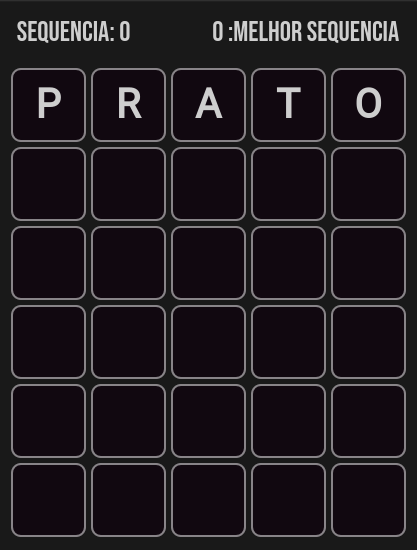
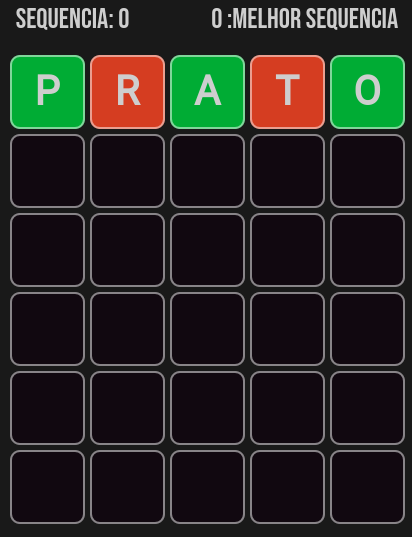
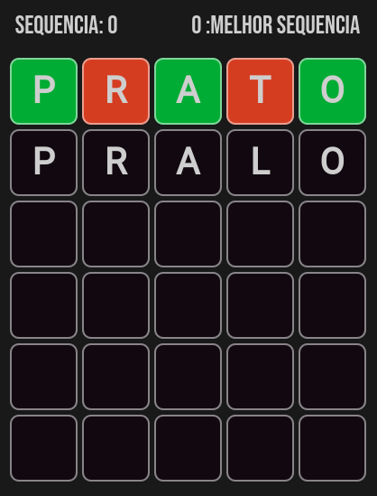
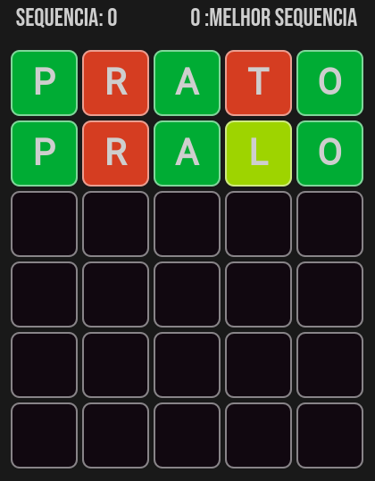
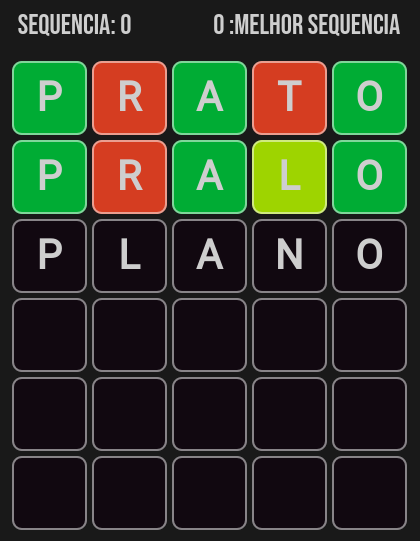
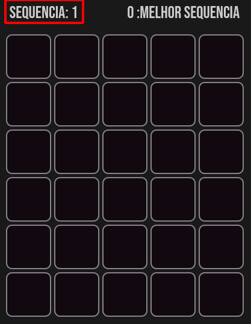
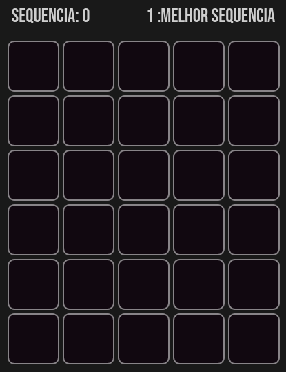

# Cermoo

## Um jogo de palavras baseado no [term.ooo](https://term.ooo)

---

### Sumario

- [Como o jogo funciona](#como-funciona)
- [TODO](#todo)

### <a id="como-funciona">Como o jogo funciona</a>

A cada rodada, uma palavra palavra de 5 letras é sorteada, sua missão é acertar essa palavra usando como dias a cor das letras após cada tentativa.

Por exemplo, nesse jogo, a primeira tentativa será prato.

Após pressionar enter, o tabuleiro se modifica e fica assim

Quadrados verdes significam que a letra existe na palavra e está na posição correta, quadrados vermelhos, significam que a letra não existe na palava.

Em seguida, vamos testar a palavra pralo:

Quadrados amarelos significam que a letra existe na palavra mas está na posição errada.

Por fim, vamos testar a palavra plano:

Por ser a palavra certa, quando você pressionar Enter, poderá escolher compartilhar no Twitter ou jogar de novo. Caso escolha jogar novamente, sua sequencia será acrescentada em 1.

Caso perca dessa vez, sua sequencia será zerada e, caso a sequencia atual seja maior que sua melhor sequencia, esta será modificada.

### <a id="todo">TODO</a>

- [ ] Fazer melhores telas de vencedor e perdedor
- [ ] Fazer um teclado para o jogo funcionar na versão mobile
- [ ] Fazer dicas para as palavras da rodada como definição do dicionário
- [ ] Fazer um board de highscore
- [ ] Fazer um metodo mais seguro para armazenas os pontos impossibilitando a mudança pelo usuário
  ~~Usar criptografia talvez?~~

### Notas do criador

Olá, tudo bom? Meu nome é Augusto Sigolo e sou desenvolvedor web.

Esse jogo foi feito com base no jogo [term.ooo](https://term.ooo) como forma de melhorar minhas habiliades com javascript vanilla e frontend, principalmente. 

Sinta-se livre para fazer o que quiser com o código, logo menos adicionarei uma licensa aqui no github também.

Sempre que houverem mudanças, você pode checá-las aqui, além disso, você pode jogar a versão mais recente do jogo em [projects.sigolo.me](projects.sigolo.me/cermoo/cermoo.html).

Se quiser saber mais sobre mim, você pode visitar o [meu site](https://sigolo.me) e me enviar uma mensagem.

Seja feliz!

